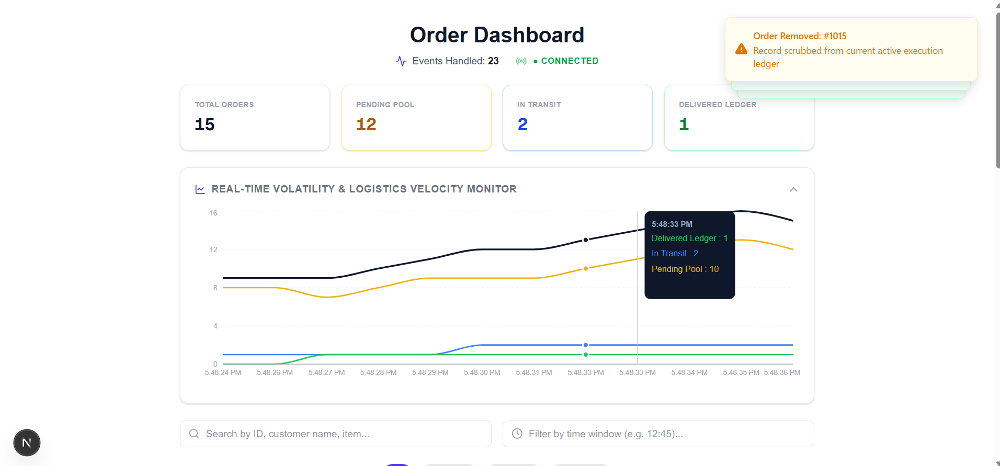
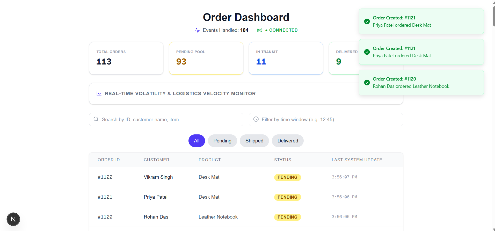
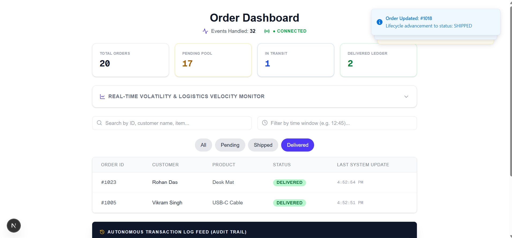
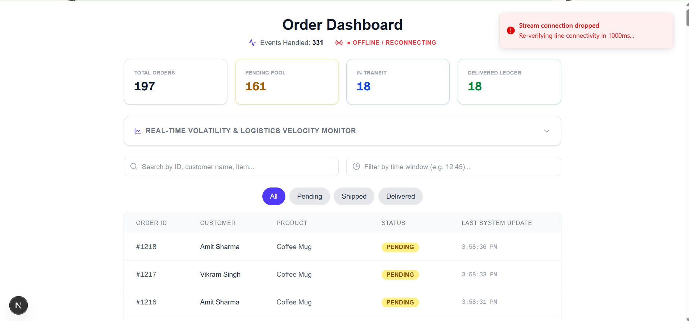
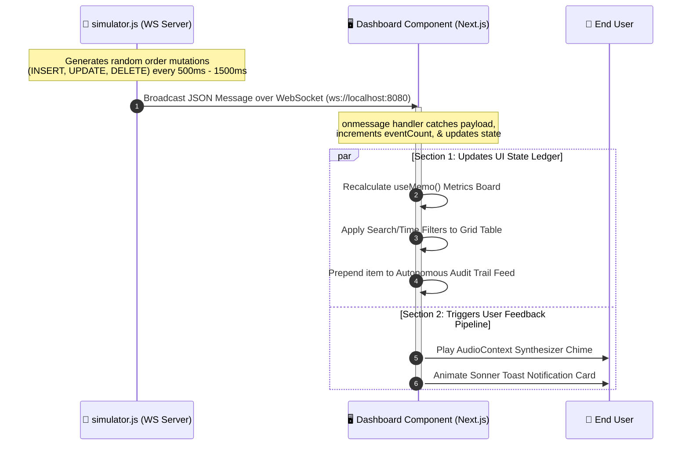

# 🚀 Apt Real-Time Order Dashboard

An enterprise-grade, real-time trading order dashboard powered by a simulated transaction engine. This project features a full-stack WebSocket architecture that streams order mutations (inserts, updates, and deletes) natively from a background simulator to a highly responsive, modern Next.js dashboard UI.

---

## 🌐 Live Production Deployments

The full-stack application has been successfully decoupled and deployed across dedicated cloud infrastructure environments:

* **⚡ Frontend Dashboard (Hosted on Vercel):** [https://apt-interview-assignment.vercel.app/](https://apt-interview-assignment.vercel.app/)
* **📡 WebSocket Simulation Engine (Hosted on Render):** `wss://apt-interview-assignment.onrender.com`

> ### ⏳ Operational Note: Cold Starts
> Because the background trading simulator is hosted on **Render’s Free Tier**, the server automatically container-sleeps during periods of inactivity. 
> 
> * **First Load Delay:** When opening the dashboard for the first time, please allow **50+ seconds** for the Render instance to wake up.
> * **Live Ignition:** Once active, the status indicator will flip to green (`● Connected`), and live transaction streams will instantly populate starting cleanly from order `#1001`.

---

## 📸 Media Showcase & Demos

- **Main Dashboard View:** 
- **Closed Graph Dashboard:** 
- **Filtered Dashboard:** 
- **Disconnected Dashboard:** 

### 🎥 Video Demonstration & Walkthrough

<video src="./public/display/demo.mp4" width="100%" controls>
  Your browser does not support the video tag.
</video>

---

## 🛠️ System Architecture

The project consists of two core components operating in tandem:

1. **The Order Simulation Engine (`simulator.js`):** A lightweight Node.js WebSocket server running on port `8080`. It generates simulated trading events (INSERT, UPDATE, DELETE) at random intervals (500ms – 1500ms) and broadcasts them to all connected frontend clients.
2. **The Order Dashboard UI (`app/page.tsx`):** A client-side Next.js dashboard utilizing React. It opens a persistent WebSocket connection to the simulator, processes the event pipeline, manages order state dynamically, and offers advanced analytics, search, filtering, and auditory feedback.


---

## ✨ Key Features

### 1. Real-Time Data Streaming & Resilient Pipeline
*   **Persistent WebSockets:** Establishes a native WebSocket connection on `ws://localhost:8080`.
*   **Automatic Reconnect Logic:** If the stream drops, the client automatically attempts reconnection within `200ms` (during initial load) or `1000ms` (during live operation), showing clear UI connection state warnings.

### 2. Metrics & Analytics Board
*   Four interactive summary cards displaying real-time aggregates:
    *   **Total Orders:** Full count of active items in the ledger.
    *   **Pending Pool:** Orders awaiting processing (Yellow card).
    *   **In Transit:** Shipped orders currently en route (Blue card).
    *   **Delivered Ledger:** Successfully completed deliveries (Green card).

### 3. Auditory Ledger Alerts (Sonic Branding)
The dashboard uses the browser’s native `AudioContext` API to generate distinct synthesizer alerts for each event type, giving operators immediate acoustic situational awareness:
*   🟢 **INSERT Events:** High-pitched chime (`800 Hz`, `120ms` duration) indicates new orders entering the pool.
*   🔵 **UPDATE Events:** Mid-pitched hum (`550 Hz`, `100ms` duration) signals status changes or transitions.
*   🔴 **DELETE Events:** Low-pitched drop (`300 Hz`, `150ms` duration) warns of order removals.

### 4. Advanced Live Filters & Search
*   **Status Filter Tabs:** Switch between showing All, Pending, Shipped, or Delivered orders instantly.
*   **Text Search Box:** Filter orders dynamically by Order ID, Customer Name, or Product Name.
*   **Time-Window Filter:** A dedicated input to filter records by their system update timestamp (e.g., `12:45`).

### 5. Autonomous Audit Trail Panel
*   A terminal-style console panel displaying a running audit log of the last 50 transactions.
*   Color-coded labels indicate the action type (`INSERT`, `UPDATE`, `DELETE`) with exact timestamps and descriptions.

---

## 🗃️ Data Schema Contracts

### Order Interface
```typescript
type Order = {
  id: number;
  customer_name: string;
  product_name: string;
  status: "pending" | "shipped" | "delivered";
  updated_at: string;
};
```

### WebSocket Message Interface
```typescript
type WebSocketMessage = {
  eventType: "INSERT" | "UPDATE" | "DELETE";
  new?: Order;
  old?: { id: number };
  timestamp?: string;
};
```

---

## ⚡ Getting Started & Running Locally

### 1. Prerequisites
Ensure you have [Node.js](https://nodejs.org/) (v18 or higher recommended) installed.

### 2. Installation
Clone the repository and install the project dependencies:
```bash
npm install
```

### 3. Running the Project

You can run both the Next.js development server and the WebSocket trading simulator concurrently with a single command:
```bash
npm run dev:all
```

Alternatively, you can run them in separate terminal sessions:

*   **Start the WebSocket simulator:**
    ```bash
    node simulator.js
    ```
*   **Start the Next.js dashboard UI:**
    ```bash
    npm run dev
    ```

Once running:
*   Open [http://localhost:3000](http://localhost:3000) to view the live dashboard.
*   The simulator broadcasts to port `8080`.

---

## 📁 Repository Layout
```
├── app/
│   ├── layout.tsx     # Next.js Root Layout
│   └── page.tsx       # Real-Time Dashboard UI component
├── public/            # Static assets & media placeholder folder
├── simulator.js       # WebSocket Server & Trading Generator script
├── package.json       # Dependencies, scripts, and build configurations
└── README.md          # Project documentation (this file)
```
